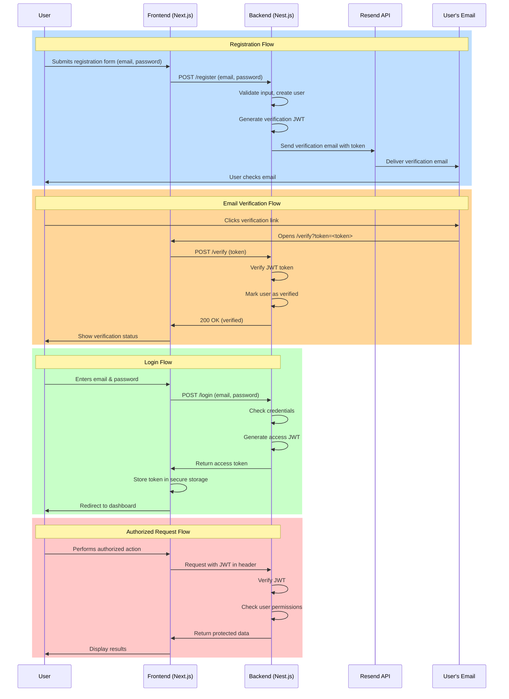

# Purple Music – Backend 🎚️
**NestJS API server for the Purple Music studio booking platform**

This is the backend for **Purple Music**, a real-world SaaS project built to automate bookings for a music studio. It handles authentication, data access, email verification, and business logic for the platform.

---

## 🛠️ Tech Stack

- **Framework**: [NestJS](https://nestjs.com/)
- **ORM**: [Prisma](https://www.prisma.io/) + PostgreSQL
- **Auth**: [Passport.js](http://www.passportjs.org/)
- **Email**: [Resend](https://resend.com/) for transactional email
- **Docs**: Swagger / OpenAPI auto-generated from decorators
- **Testing**: Jest (currently WIP)
- **Validation**: class-validator + class-transformer

---

## 🔐 Authentication System

Fully modular auth system using Passport.js with the following strategies:

- Local credentials (bcrypt hashed passwords)
- Telegram OAuth
- Yandex OAuth

Tokens are issued using JWT and securely stored in cookies (handled by the frontend). Email verification and password resets are handled through secure token-based flows.



---

## 🗃️ Database

- Managed with Prisma and PostgreSQL
- Schema designed from scratch
- Includes:
    - Users
    - Bookings
    - Studios
    - Availability
    - Email verification tokens, password reset tokens, etc.

---

## 📚 API Documentation

- Fully documented using **Swagger**
- Available at `/api/docs` when the server is running
- Auto-generated from decorators and DTOs

---

## 📁 Project Structure (simplified)

```bash
/src
├── auth               # Passport strategies + auth service
├── booking            # Booking-related logic
├── time-slots         # Current taken slots
├── free-slots         # Dynamically calculated free slots out of taken slots
├── studio             # Studio and schedule management
├── users              # User management
├── common             # Exceptions, mails, etc
├── main.ts            # Entry point
/prisma
├── migrations        # Prisma migrations
├── schema.prisma      # Prisma schema
```

---

## 🚀 Getting Started

```bash
# Install dependencies
npm install

# Generate Prisma client
npm prisma generate

# Run development server
npm start:dev
```

Requires:
- `.env` file with database URL, JWT secret, Resend API key, OAuth secrets, etc.

---

## 🧪 Tests

Basic test setup using **Jest**. Test coverage is limited for now and a work in progress.

```bash
$ npm run test

# test coverage
$ npm run test:cov
```

---

## 📋 TODOs & Improvements

- [ ] Expand unit and e2e tests
- [ ] Add rate limiting and better logging

## 🤖 Integration Points

- Frontend (Next.js app via REST API)
- Telegram Mini App (auth integration)
- Docker-based infra (home lab hosted)

## 🧑‍💻 Author

Built and maintained by @KhoDis. Part of a fullstack real-world project for managing a real studio’s operations.


## Run tests

```bash
# unit tests
$ npm run test

# e2e tests
$ npm run test:e2e
```
